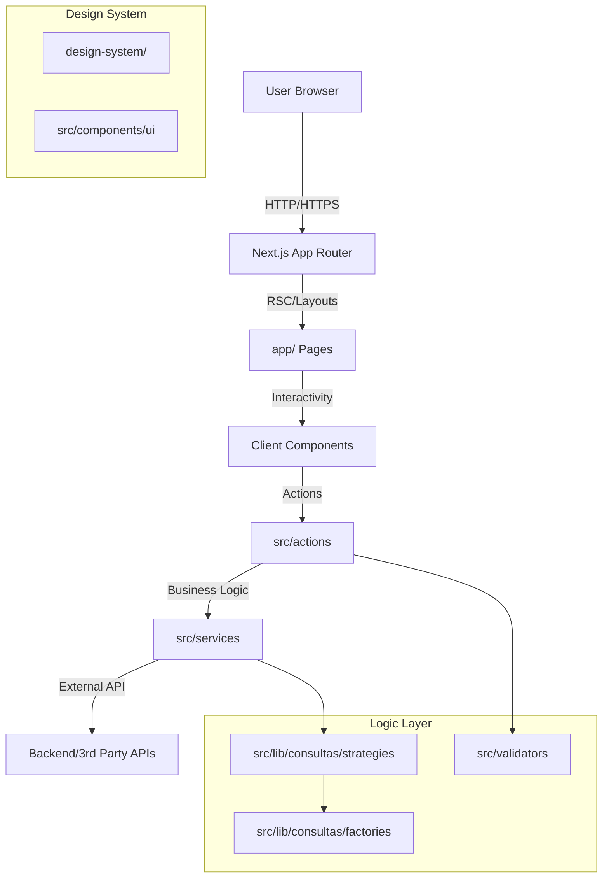

# Architecture

## System Overview
Candle Frontend is a monolithic web application built on **Next.js 14+** using the **App Router** architecture. It serves as the primary interface for users to interact with credit assessment and financial query services. The application leverages **Server Actions** for secure, server-side data mutations and **React Server Components (RSC)** for optimal performance and SEO.

## Architecture Diagram (Mermaid)


## Directory Structure
The project follows a feature-based and layered structure:

```
/
├── app/                  # Next.js App Router (Routes & Layouts)
│   ├── (auth)/           # Authentication routes group
│   ├── (home)/           # Landing page routes
│   ├── dashboard/        # User dashboard
│   ├── credito/          # Credit assessment flows
│   └── consulta/         # Query execution flows
├── src/
│   ├── actions/          # Server Actions (Mutations & Data Fetching)
│   ├── components/       # React Components
│   │   ├── ui/           # Shared UI components (ShadCN/Radix)
│   │   ├── payment/      # Payment specific components
│   │   ├── credito/      # Credit feature components
│   │   └── ...
│   ├── lib/              # Shared utilities and logic
│   │   ├── api/          # API clients and error handling
│   │   └── consultas/    # Strategies & Factories for queries
│   ├── services/         # Business logic & Service integration
│   ├── types/            # TypeScript definitions
│   └── validators/       # Zod schemas for data validation
├── design-system/        # Core design tokens and global styles
└── public/               # Static assets
```

## Component Architecture
- **Server Components:** Used by default for pages (`page.tsx`) and layouts (`layout.tsx`) to handle data fetching and initial rendering.
- **Client Components:** Used for interactive elements (forms, buttons, modals). Marked with `"use client"`.
- **UI Library:** Built on top of ShadCN UI w/ Tailwind CSS, located in `src/components/ui`.
- **Design System:** Custom design implementation found in `design-system/` ensuring visual consistency.

## Data Flow
1. **Request:** User interacts with a Client Component (e.g., submits a form).
2. **Validation:** Input is validated using Zod schemas (`src/validators`) on the client (optional) and strictly on the server.
3. **Action:** A Server Action (`src/actions`) is triggered.
4. **Service:** The action calls a Service (`src/services`) or specific Strategy (`src/lib/consultas`).
5. **Mutation:** The service communicates with external APIs or databases.
6. **Response:** The result (`ActionState`) is returned to the client to update the UI.

## Design Patterns
- **Strategy Pattern:** Used in `src/lib/consultas/strategies` to handle different types of query logic (e.g., CPF vs CNPJ, different vendors) interchangeably.
- **Factory Pattern:** Used in `src/lib/consultas/factories` to instantiate the correct strategy based on input context.
- **Repository/Service Pattern:** Encapsulated in `src/services` to decouple business logic from the UI and Server Actions.

## Key Decisions & Trade-offs
- **Server Actions vs API Routes:** We prioritize Server Actions for form submissions and mutations to reduce client-side JavaScript and simplify data invalidation, keeping API routes (`app/api`) primarily for webhooks or external integrations.
- **Tailwind CSS:** Chosen for rapid development and co-location of styles, ensuring a smaller CSS bundle size.
- **TypeScript:** Enforced strictly to prevent runtime errors and improve developer experience with auto-completion.

## Related Resources
- [Project Overview](./project-overview.md)
- [Development Workflow](./development-workflow.md)
- [Tooling](./tooling.md)
